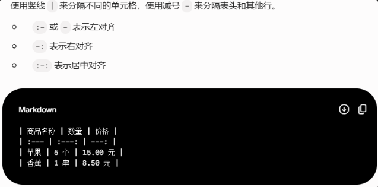

# Markdown常用语法
#### #:标题(1->6个#表示1->6级标题)
#### 插入图片直接拖进来
#### \---横线
#### 加粗:文字左右各加两个*或两个_
#### 斜体:文字左右各加一个*或一个_
#### 加粗+斜体:各加三个*
#### 删除线:各加两个~
### 换行(记得换行)
1. 两个空格（行间距较小）
2. 两次回车（行间距较大）
3. 中间插入\<br>
### 显示特殊字段
1. 字段前方加入\\转义
2. \\text{\字段} 变正体
### 列表
1. 无序列表: **\*** */* **\+** */* **\-** 加空格
2. 有序列表: 数字+英文句点 . +空格
3. 任务列表: 减号、空格和方括号 **\"- []"** ,方括号内为空表示未完成，写上 x 表示已完成
### 引用与代码
1. 区块引用: 开头加上>
2. 行内代码: 用反单引号 `（键盘 Esc 键下方的波浪线键）把它们包起来
3. 用三个反单引号 ``` 包裹.开头写上编程语言的名称,可实现代码高亮
### 链接与多媒体
1. 超链接: \[链接文字](链接地址)
2. 插入图片: \![图片名称]\(图片地址)
### 高级排版
1. 表格: 
---
#### Ctrl+Enter运行当前单元格
#### Shift+Enter运行当前单元格 并选择下面的单元格
#### Alt+Enter运行当前单元格 并在下面插入新单元格
#### A键在上面插入单元格
#### B键在下面插入单元格
#### M/Y切换单元格属性
#### 两下D删除选中的单元格
#### Ctrl+Shift+H键显示快捷键
---
# 公式  
#### 公式两边各加一个$:行内的公式 || 各加两个:表示独立公式
### 一.矩阵

$$
\begin{matrix}
1 & 0 \\
0 & 1
\end{matrix}
$$

$$
\begin{bmatrix}
1 & 0 \\
0 & 1
\end{bmatrix}
$$

$$
\left[\begin{array}{lr|r}
a_1 & b_1 & d_1 \\
a_2 & b_2 & d_2 
\end{array}\right]
$$
(这里`\begin{array}`后`{lcr|r}`中 l、c、r分别表示左对齐、居中、右对齐，|表示方块标记)
(`\left``\right`后面的方括号是围成矩阵的符号)

$$
\begin{pmatrix}
1 & 0 \\
0 & 1
\end{pmatrix}
$$

$$
\begin{vmatrix}
1 & 0 \\
0 & 1
\end{vmatrix}
$$


$$
\begin{bmatrix}
a_{11} & a_{12} & \cdots & a_{1n} \\
a_{21} & a_{22} & \cdots & a_{2n} \\
\vdots & \vdots & \ddots & \vdots \\
a_{m1} & a_{m2} & \cdots & a_{mn}
\end{bmatrix}
$$

$$
大括号
\begin{cases}
  1 \\
  2 \\
  3 \\
\end{cases}
$$
 
### 二.积分、求和
#### $$\sum_{i=1}^{n} a_i$$
#### $$\begin{matrix} \sum_{k=1}^N k^2 \end{matrix}$$
#### $$\prod_{i=1}^Nx_i$$
#### $$\begin{matrix} \prod_{i=1}^N x_i \end{matrix}$$
#### $$\int_{-N}^{N} e^x\, dx$$
#### $$\begin{matrix} \int_{-N}^{N} e^x\, dx\end{matrix}$$
#### $$\iint_{-N}^{N} e^x\, dx$$
#### $$\iiint_{-N}^{N} e^x\, dx$$
#### $$\oint_{C} x^3\, dx + 4y^2\, dy$$
### 三.乘除法
1. 乘法
  - 叉乘: $a\times b$
  - 点乘: $a\cdot b$
2. 除法
  - 除号: $a\div b$
  - 分数: $\frac{分子}{分母}$
### 四.幂/次方
1. 单字符: $x^2$
2. 多字符: $e^{ab}$
### 五.对数
1. 自然对数: $\ln x$
2. 带底数的对数: $\log_2 n$
3. 常用对数: $\log_{10}$
### 六.极限
#### $$\lim\limits_{a\rarr+\infin}{a+114}$$
### 七.脚注
1. 请输入文本[^1],请输入文本[^2],请输入[^文本],请输入[^文本]
### 八.特殊符号
1. $\therefore$
2. $\because$
3. $\ge\geq\geqq\le\leq\leqq$
4. $\lrArr\rArr\lArr\rarr\larr\lrarr$
5. $\overline{x}$
6. $x_{i}$
7. $\cdot$
8. 希腊字母:
   + $\Alpha\alpha$
   + $\Beta\beta$
   + $\Gamma\gamma$
   + $\Delta\delta$
   + $\Epsilon\epsilon$
   + $\Zeta\zeta$
   + $\Eta\eta$
   + $\Theta\theta$
   + $\Iota\iota$
   + $\Kappa\kappa$
   + $\Lambda\lambda$
   + $\Mu\mu$
   + $\Nu\nu$
   + $\Xi\xi$
   + $\Omicron\omicron$
   + $\Pi\pi$
   + $\Rho\rho$
   + $\Sigma\sigma$
   + $\Tau\tau$
   + $\Upsilon\upsilon$
   + $\Phi\phi$
   + $\Chi\chi$
   + $\Psi\psi$
   + $\Omega\omega$
---
[^1]:114514
[^2]:1919810
[^文本]:如题所示